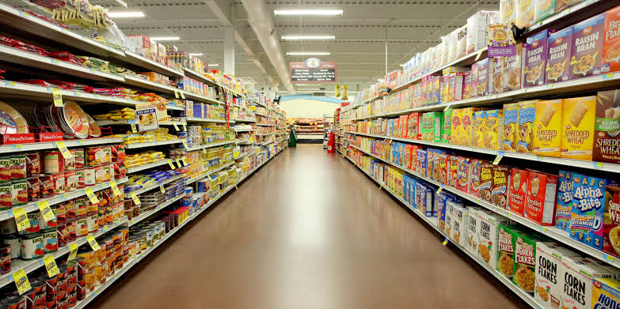
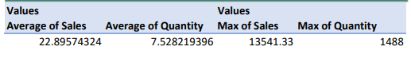
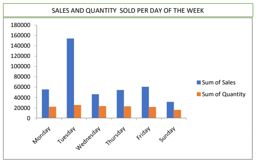
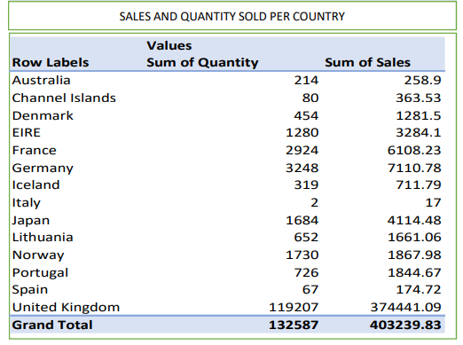

# SUPERSTORE-WEEKLY-SALES-ANALYZES

# INTRODUCTION

This data showed weekly sales recorded in a super store across the countries where there are outlets. The data was cleaned, analyzed and then visualized using excel. 

# PROBLEM STATEMENT

The problem is to know the following within the data;
1. What is the average sales, average quantity, maximum sales and maximum quantity of goods?
2. What is the total (sum of) sales and quantity sold per day of the week?
3. What is the total (sum of) sales and quantity sold per country?
4. What product sales most in the store?
   

# SKILLS DEMONSTRATED  

This project was completed using excel- major concepts used were filter, pivot table, formulas- SUMIF, MAX.

# DATA SOURCING
The data was gotten online and downloaded as a xlsx file [click here](https://github.com/Somoye-D-Dataman/Superstore-weekly-sales-analyzes/blob/main/Weekly_sales_report.xlsx) which has a total of 538364 rows.

# ANALYSIS
1. From analysis, the average sale in the store was $22.89574324i.e $22.90 while the average quantity sold was 7,528219396 i.e. 7.53
   The maximum sale recorded was $13541.33 while the maximum quantity was 1488.

   
2. From the graph it was discovered that the most sale were carried out on Tuesday then followed by Friday and Monday with $154177.4, $60960.9 and $55800.7 respectively.  (NOTE: sales quantity was done using  SUMIF e.g. =SUMIF(F1:F538364, N5, K1:K538364), the total (sum of) quantity of products ordered was uniform throughout the week. This could be because the start of working week in most countries is Monday while end of working week is Friday hence people are likely to go out during these days and by Tuesday most people would have resumed to work and likely to visit stores during these days. The maximum sale recorded was $13541.33 while the maximum quantity was 1488.

   
3. Most products were sold to customers in United Kingdom with quantity of 119207 and total sales of $374441.09.

   
4. Round Snack boxes with set of 4 fruits was the most bought product (this was done looking for the maximum quantity of sold product which was 1488 and then filtering the number).

# CONCLUSION 

The weekly sales in the store shows that Round Snack boxes with set of 4 fruits was the most bought product while most sales was done on Tuesday and most sales came from loyal customers in United Kingdom.

# RECOMMENDATION
There is need to intensify marketing in countries where sales was low like Italy and Spain or close down the outlet if sales remain poor in order to cut down on expenses.
